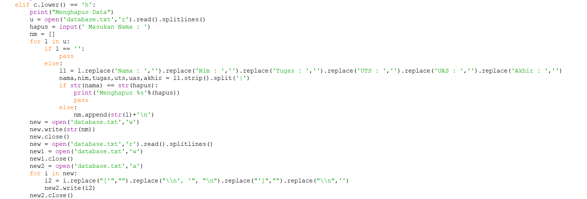
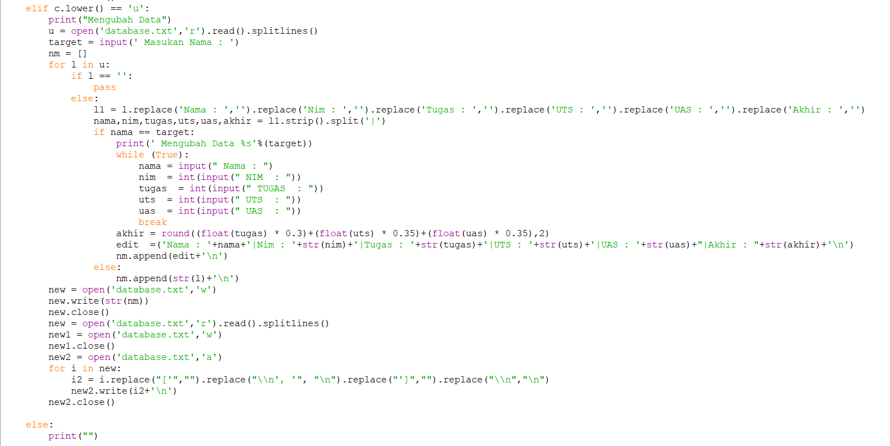

# Praktikum-5

# Latihan-1
# 1. Membuat Dictionary Daftar kontak
1. Programnya

2. Hasil Program

# 2. Menampilkan Kontak Ari
1. Programnya

2. Hasil Program

# 3. Menambah Kontak Baru
1. Programnya

2. Hasil Program

# 4. Mengubah Kontak Dina dengan nomor 088999776
1. Programnya

2. Hasil Program

# 5. Menampilkan Semua Nama
1. Programnya

2. Hasil Program

# 6. Menampilkan Semua Nomor
1. Programnya

2. Hasil Program

# 7. Menampilkan Daftar Nama dan Nomor
1. Programnya

2. Hasil Program

# 8. Menghapus Kontak Dina
1. Programnya

2. Hasil Program

# TUGAS PRAKTIKUM 5
# Menampilkan Daftar Nilai Mahasiswa

1. Disini saya akan membuat program menampilkan daftar nilai mahasiswa.
2. untuk programnya saya menggunakan fungsi import os.system, yang berfungsi agar bisa mengakses database.txt yang saya buat. Dan juga saya menggunakan perulangan dan juga if else.
3. program untuk menampilkan daftar nilai, sebagai berikut:

4. Hasil programnya.

5. Program untuk menambahkan data. sebagai berikut:

6. Hasil programnya.

7. program untuk Mencari data. Sebagai berikut:

8. Hasil program.

9. Program untuk menghapus data. Sebagai berikut:

10. Hasil program.

11. Program untuk mengubah data. Sebagai berikut :

12. Hasil program.
