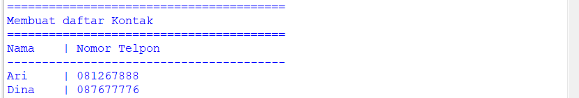
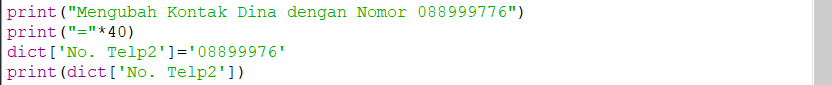

# Praktikum-5
# Latihan-1
# 1. Membuat Dictionary Daftar kontak
1. Programnya

2. Hasil Program

# 2. Menampilkan Kontak Ari
1. Programnya

2. Hasil Program

# 3. Menambah Kontak Baru
1. Programnya

2. Hasil Program

# 4. Mengubah Kontak Dina dengan nomor 088999776
1. Programnya

2. Hasil Program

# 5. Menampilkan Semua Nama
1. Programnya

2. Hasil Program

# 6. Menampilkan Semua Nomor
1. Programnya

2. Hasil Program

# 7. Menampilkan Daftar Nama dan Nomor
1. Programnya

2. Hasil Program

# 8. Menghapus Kontak Dina
1. Programnya

2. Hasil Program

